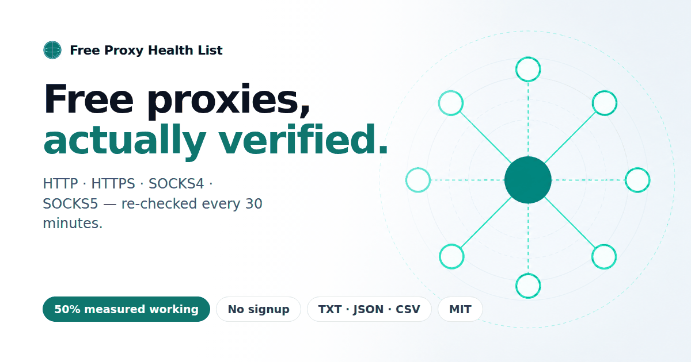
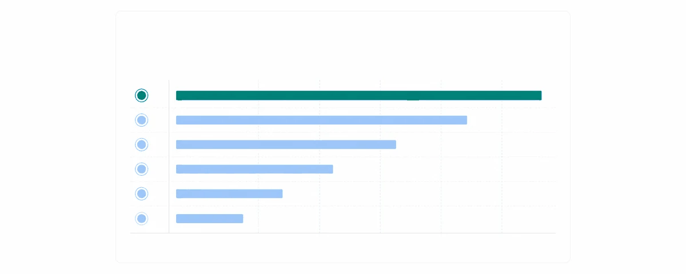

<!-- proxyhealthlist:generated — rebuilt by `proxyhealthlist build-site` from the published
     snapshot. Hand edits are overwritten on the next run; change the
     generator (proxyhealthlist/site/) or open an issue instead. -->
<div align="center">

<a href="https://xyzs996.github.io/free-proxy-health-list/id/"></a>

# Free Proxy Health List

**Daftar proxy gratis yang benar-benar terverifikasi.**

[](https://github.com/xyzs996/free-proxy-health-list/blob/main/proxies/badges/total.json) [](https://github.com/xyzs996/free-proxy-health-list/blob/main/proxies/badges/http.json) [](https://github.com/xyzs996/free-proxy-health-list/blob/main/proxies/badges/socks5.json) [](https://github.com/xyzs996/free-proxy-health-list/blob/main/proxies/badges/updated.json) [](https://github.com/xyzs996/free-proxy-health-list/blob/main/proxies/badges/reliability.json)
[](https://github.com/xyzs996/free-proxy-health-list/actions/workflows/validate-snapshot.yml)
[](https://github.com/xyzs996/free-proxy-health-list/stargazers)

[🌐 Unduh](https://xyzs996.github.io/free-proxy-health-list/id/) · [⚡ Pro API](https://xyzs996.github.io/free-proxy-health-list/id/api.html) · [📊 Berapa biaya menjalankan agen AI?](https://github.com/xyzs996/llm-api-pricing/blob/main/README_ID.md) · [💬 Negara mana yang Anda butuhkan?](https://github.com/xyzs996/free-proxy-health-list/issues/new?template=country.yml&came_from=README_ID.md) · [🐞 Issues](https://github.com/xyzs996/free-proxy-health-list/issues)

[English](./README.md) · [中文](./README_CN.md) · [日本語](./README_JA.md) · [한국어](./README_KO.md) · [Español](./README_ES.md) · [Português](./README_PT.md) · [Русский](./README_RU.md) · [Türkçe](./README_TR.md) · **Bahasa Indonesia** · [Tiếng Việt](./README_VI.md)

</div>

> Cuplikan publik · diperbarui tiap 30 menit · tanpa pendaftaran

## 💡 Kenapa proyek ini ada?

Beberapa waktu lalu saya membuat scraper pelacak harga kecil. Setiap kali dijalankan selalu kena rate limit dari satu IP saya, jadi saya mencari proxy gratis. Semua daftar bercerita sama: separuh entrinya mati, yang bertuliskan "diperbarui harian" sudah berbulan-bulan tidak berubah, dan situs yang proxy-nya benar-benar jalan minta kartu kredit bahkan sebelum saya boleh mencoba.

Saya memang sudah menjalankan pemeriksaan kesehatan otomatis untuk scraping sendiri, jadi saya mulai menerbitkan hasilnya — daftar proxy gratis yang **benar-benar terverifikasi**, diperiksa ulang tiap 30 menit, dan bisa diambil dari tautan CDN yang stabil. Tanpa pendaftaran, tanpa kartu kredit, tanpa dasbor. Hanya itu. Kalau ini menghemat sore yang dulu saya buang, sebuah bintang membantu pengembang berikutnya menemukannya. Datanya tetap gratis.

## 🚀 Salin dan pakai

Satu perintah per format. Jalur stabil yang tidak berubah.

```shell
# Semua proxy
curl -sL https://raw.githubusercontent.com/xyzs996/free-proxy-health-list/main/all.txt -o proxies.txt

# SOCKS5
curl -sL https://raw.githubusercontent.com/xyzs996/free-proxy-health-list/main/socks5.txt -o socks5.txt
```

## 📦 Unduh berkas

| Daftar | Proxy | TXT | JSON | CSV | CDN |
| --- | --- | --- | --- | --- | --- |
| **Semua proxy** | `4,196` | [TXT](https://raw.githubusercontent.com/xyzs996/free-proxy-health-list/main/all.txt) | [JSON](https://raw.githubusercontent.com/xyzs996/free-proxy-health-list/main/proxies/all/data.json) | [CSV](https://raw.githubusercontent.com/xyzs996/free-proxy-health-list/main/proxies/all/data.csv) | [jsDelivr](https://cdn.jsdelivr.net/gh/xyzs996/free-proxy-health-list@main/proxies/all/data.txt) |
| HTTP | `1,090` | [TXT](https://raw.githubusercontent.com/xyzs996/free-proxy-health-list/main/http.txt) | [JSON](https://raw.githubusercontent.com/xyzs996/free-proxy-health-list/main/proxies/protocols/http/data.json) | [CSV](https://raw.githubusercontent.com/xyzs996/free-proxy-health-list/main/proxies/protocols/http/data.csv) | [jsDelivr](https://cdn.jsdelivr.net/gh/xyzs996/free-proxy-health-list@main/proxies/protocols/http/data.txt) |
| HTTPS | `1,587` | [TXT](https://raw.githubusercontent.com/xyzs996/free-proxy-health-list/main/https.txt) | [JSON](https://raw.githubusercontent.com/xyzs996/free-proxy-health-list/main/proxies/protocols/https/data.json) | [CSV](https://raw.githubusercontent.com/xyzs996/free-proxy-health-list/main/proxies/protocols/https/data.csv) | [jsDelivr](https://cdn.jsdelivr.net/gh/xyzs996/free-proxy-health-list@main/proxies/protocols/https/data.txt) |
| SOCKS4 | `930` | [TXT](https://raw.githubusercontent.com/xyzs996/free-proxy-health-list/main/socks4.txt) | [JSON](https://raw.githubusercontent.com/xyzs996/free-proxy-health-list/main/proxies/protocols/socks4/data.json) | [CSV](https://raw.githubusercontent.com/xyzs996/free-proxy-health-list/main/proxies/protocols/socks4/data.csv) | [jsDelivr](https://cdn.jsdelivr.net/gh/xyzs996/free-proxy-health-list@main/proxies/protocols/socks4/data.txt) |
| SOCKS5 | `589` | [TXT](https://raw.githubusercontent.com/xyzs996/free-proxy-health-list/main/socks5.txt) | [JSON](https://raw.githubusercontent.com/xyzs996/free-proxy-health-list/main/proxies/protocols/socks5/data.json) | [CSV](https://raw.githubusercontent.com/xyzs996/free-proxy-health-list/main/proxies/protocols/socks5/data.csv) | [jsDelivr](https://cdn.jsdelivr.net/gh/xyzs996/free-proxy-health-list@main/proxies/protocols/socks5/data.txt) |
| Proxy cepat | `790` | [TXT](https://raw.githubusercontent.com/xyzs996/free-proxy-health-list/main/proxies/latency/fast/data.txt) | [JSON](https://raw.githubusercontent.com/xyzs996/free-proxy-health-list/main/proxies/latency/fast/data.json) | [CSV](https://raw.githubusercontent.com/xyzs996/free-proxy-health-list/main/proxies/latency/fast/data.csv) | [jsDelivr](https://cdn.jsdelivr.net/gh/xyzs996/free-proxy-health-list@main/proxies/latency/fast/data.txt) |
| Proxy stabil | `1,550` | [TXT](https://raw.githubusercontent.com/xyzs996/free-proxy-health-list/main/proxies/stability/stable/data.txt) | [JSON](https://raw.githubusercontent.com/xyzs996/free-proxy-health-list/main/proxies/stability/stable/data.json) | [CSV](https://raw.githubusercontent.com/xyzs996/free-proxy-health-list/main/proxies/stability/stable/data.csv) | [jsDelivr](https://cdn.jsdelivr.net/gh/xyzs996/free-proxy-health-list@main/proxies/stability/stable/data.txt) |
| Proxy elite | `2,998` | [TXT](https://raw.githubusercontent.com/xyzs996/free-proxy-health-list/main/proxies/anonymity/elite/data.txt) | [JSON](https://raw.githubusercontent.com/xyzs996/free-proxy-health-list/main/proxies/anonymity/elite/data.json) | [CSV](https://raw.githubusercontent.com/xyzs996/free-proxy-health-list/main/proxies/anonymity/elite/data.csv) | [jsDelivr](https://cdn.jsdelivr.net/gh/xyzs996/free-proxy-health-list@main/proxies/anonymity/elite/data.txt) |

**Jelajahi per negara:** [Indonesia](https://raw.githubusercontent.com/xyzs996/free-proxy-health-list/main/proxies/countries/id/data.txt), [United States](https://raw.githubusercontent.com/xyzs996/free-proxy-health-list/main/proxies/countries/us/data.txt), [China](https://raw.githubusercontent.com/xyzs996/free-proxy-health-list/main/proxies/countries/cn/data.txt), [India](https://raw.githubusercontent.com/xyzs996/free-proxy-health-list/main/proxies/countries/in/data.txt), [Bangladesh](https://raw.githubusercontent.com/xyzs996/free-proxy-health-list/main/proxies/countries/bd/data.txt), [Philippines](https://raw.githubusercontent.com/xyzs996/free-proxy-health-list/main/proxies/countries/ph/data.txt), [Mexico](https://raw.githubusercontent.com/xyzs996/free-proxy-health-list/main/proxies/countries/mx/data.txt), [Brazil](https://raw.githubusercontent.com/xyzs996/free-proxy-health-list/main/proxies/countries/br/data.txt), [Colombia](https://raw.githubusercontent.com/xyzs996/free-proxy-health-list/main/proxies/countries/co/data.txt), [Vietnam](https://raw.githubusercontent.com/xyzs996/free-proxy-health-list/main/proxies/countries/vn/data.txt), [Germany](https://raw.githubusercontent.com/xyzs996/free-proxy-health-list/main/proxies/countries/de/data.txt), [Russia](https://raw.githubusercontent.com/xyzs996/free-proxy-health-list/main/proxies/countries/ru/data.txt), [Thailand](https://raw.githubusercontent.com/xyzs996/free-proxy-health-list/main/proxies/countries/th/data.txt), [Canada](https://raw.githubusercontent.com/xyzs996/free-proxy-health-list/main/proxies/countries/ca/data.txt), [Hong Kong](https://raw.githubusercontent.com/xyzs996/free-proxy-health-list/main/proxies/countries/hk/data.txt), [Venezuela](https://raw.githubusercontent.com/xyzs996/free-proxy-health-list/main/proxies/countries/ve/data.txt), [France](https://raw.githubusercontent.com/xyzs996/free-proxy-health-list/main/proxies/countries/fr/data.txt), [Japan](https://raw.githubusercontent.com/xyzs996/free-proxy-health-list/main/proxies/countries/jp/data.txt), [Singapore](https://raw.githubusercontent.com/xyzs996/free-proxy-health-list/main/proxies/countries/sg/data.txt), [Netherlands](https://raw.githubusercontent.com/xyzs996/free-proxy-health-list/main/proxies/countries/nl/data.txt), [Ecuador](https://raw.githubusercontent.com/xyzs996/free-proxy-health-list/main/proxies/countries/ec/data.txt), [Italy](https://raw.githubusercontent.com/xyzs996/free-proxy-health-list/main/proxies/countries/it/data.txt), [Cambodia](https://raw.githubusercontent.com/xyzs996/free-proxy-health-list/main/proxies/countries/kh/data.txt), [Spain](https://raw.githubusercontent.com/xyzs996/free-proxy-health-list/main/proxies/countries/es/data.txt) — [Lihat semua](https://github.com/xyzs996/free-proxy-health-list/tree/main/proxies/countries)

## 📊 Tingkat keberhasilan terukur

Hampir semua daftar proxy mengklaim terverifikasi dan tak satu pun menerbitkan angkanya. Proyek ini menerbitkannya: sampel acak dari daftar yang diterbitkan diambil secara end-to-end lewat tiap proxy ke URL pihak ketiga, dan hasilnya dirilis bersama datanya.



| Daftar | Berfungsi pada sampel |
| --- | --- |
| **Sampel terbaru** | **40%** (sampel 400) |

<sub>Metode: sampel acak, pengambilan end-to-end lewat proxy, batas waktu 8 detik — `http://api.ipify.org/, http://icanhazip.com/, https://api.ipify.org/, https://icanhazip.com/`</sub>

## 🧭 Panduan per kasus penggunaan

- **[Proxy untuk web scraping](https://xyzs996.github.io/free-proxy-health-list/id/use-cases/proxy-for-web-scraping.html)** — Putar IP agar terhindar dari limit dan blokir.
- **[Proxy di Python requests](https://xyzs996.github.io/free-proxy-health-list/id/use-cases/python-requests-proxy.html)** — Contoh HTTP dan SOCKS5 dengan percobaan ulang.
- **[Bangun kumpulan proxy berputar](https://xyzs996.github.io/free-proxy-health-list/id/use-cases/rotating-proxy.html)** — Perulangan rotasi yang jalan dalam ~20 baris.
- **[Middleware proxy Scrapy](https://xyzs996.github.io/free-proxy-health-list/id/use-cases/proxy-for-scrapy.html)** — Middleware siap pakai yang berputar saat gagal.
- **[Opsi proxy curl](https://xyzs996.github.io/free-proxy-health-list/id/use-cases/proxy-for-curl.html)** — Flag HTTP, HTTPS, dan SOCKS dengan perintah nyata.

## 🌐 Jelajahi per protokol

- [HTTP](https://xyzs996.github.io/free-proxy-health-list/id/protocols/http.html) — Paling sederhana untuk permintaan web. Cocok dengan semua klien HTTP.
- [HTTPS](https://xyzs996.github.io/free-proxy-health-list/id/protocols/https.html) — Proxy HTTP yang terverifikasi menerowongkan TLS lewat CONNECT.
- [SOCKS4](https://xyzs996.github.io/free-proxy-health-list/id/protocols/socks4.html) — Terowongan lawas yang ringan untuk TCP mentah.
- [SOCKS5](https://xyzs996.github.io/free-proxy-health-list/id/protocols/socks5.html) — Semua lalu lintas TCP, plus UDP dan DNS jarak jauh.

## 🧱 Bentuk data

`data.txt` berisi satu `host:port` per baris. `data.json` membawa metadata kesehatan tiap entri:

```json
{
  "proxy": "203.0.113.10:8080",
  "host": "203.0.113.10",
  "port": 8080,
  "protocol": "http",
  "latencyMs": 842,
  "qualityScore": 91,
  "checkType": "http_probe",
  "supportsHttps": true,
  "country": "US",
  "anonymity": "elite",
  "consecutiveSuccesses": 4,
  "reliabilityScore": 96.75,
  "reliabilitySamples": 41,
  "lastChecked": "2026-07-25T11:09:35Z"
}
```

Membacanya dengan program? [`llms.txt`](https://xyzs996.github.io/free-proxy-health-list/llms.txt) memberi seluruh snapshot dalam satu permintaan — setiap daftar dengan jumlahnya, URL unduhannya, dan tanggal pemeriksaannya.

## 🔗 Proyek terkait

Pengelola yang sama, gagasan yang sama — data publik yang bisa dibaca tanpa akun:

- **[Free LLM API list](https://github.com/xyzs996/free-llm-api)** — kuota gratis permanen; setiap batas yang diumumkan tertaut ke sumber resminya.
- **[LLM API pricing list](https://github.com/xyzs996/llm-api-pricing/blob/main/README_ID.md)** — berapa sebenarnya biaya agen pemrograman AI. Setiap angka dari tulisan dikumpulkan dalam [satu tabel](https://xyzs996.github.io/llm-api-pricing/figures.html), tiap baris membawa kalimat asalnya ([JSON](https://cdn.jsdelivr.net/gh/xyzs996/llm-api-pricing@main/data/figures.json) / [CSV](https://cdn.jsdelivr.net/gh/xyzs996/llm-api-pricing@main/data/figures.csv)). Mulai dari [ke mana sebenarnya tagihan token pergi](https://xyzs996.github.io/llm-api-pricing/topics/token-optimization.html).

## ❓ Pertanyaan yang sering diajukan

<details>
<summary><strong>Apakah proxy gratis ini aman?</strong></summary>

Proxy publik gratis dipakai bersama dan dijalankan operator tak dikenal, jadi jangan pernah mengirim kata sandi, token, atau data pribadi melaluinya. Gunakan untuk pengujian, scraping halaman publik, dan otomasi — bukan lalu lintas sensitif.
</details>

<details>
<summary><strong>Seberapa sering daftar diperbarui?</strong></summary>

Setiap proxy diperiksa ulang dan daftar diterbitkan kembali setiap 30 menit. Tiap rekaman JSON memuat lastChecked dan nilai latensi sehingga Anda bisa membuang entri yang basi atau lambat.
</details>

<details>
<summary><strong>Apa arti 'terverifikasi' di sini?</strong></summary>

Setiap entri menyelesaikan handshake sesuai protokolnya dan meneruskan permintaan nyata secara end-to-end sebelum diterbitkan. Entri yang hanya menjawab koneksi TCP tidak diterbitkan.
</details>

<details>
<summary><strong>Kenapa sebagian proxy berhenti bekerja dalam hitungan menit?</strong></summary>

Proxy gratis memang tidak stabil — terus bermunculan dan menghilang. Karena itulah daftar diperiksa ulang tiap 30 menit dan diurutkan dari yang tercepat. Selalu lanjut ke entri berikutnya saat gagal.
</details>

<details>
<summary><strong>Tipe proxy mana yang sebaiknya dipakai?</strong></summary>

HTTP paling sederhana untuk permintaan web. SOCKS5 menangani semua lalu lintas TCP plus UDP dan DNS jarak jauh. SOCKS4 alternatif lawas yang lebih ringan. Entri HTTPS adalah proxy HTTP yang terbukti bisa menerowongkan TLS.
</details>

<details>
<summary><strong>Perlukah saya mendaftar atau memberi bintang?</strong></summary>

Tidak. Daftar ini cuplikan sepenuhnya publik di URL stabil, tanpa akun dan tanpa kartu kredit. Bintang hanya membantu pengembang lain menemukannya.
</details>

## 🧾 Dijawab panjang, lengkap dengan angkanya

Jawaban di atas sengaja dibuat singkat. Yang ini tidak: masing-masing dibuka dengan jawaban langsung, lalu menunjukkan setiap angka hasil pengukuran di baliknya, termasuk ukuran sampel dan waktu pengukurannya:

- [How many free proxies actually work? Here is the measured rate, by protocol.](https://github.com/xyzs996/free-proxy-health-list/discussions/2) — the measured end-to-end success rate of a random sample, broken out by protocol, with the method and the timeout it was measured under.
- [Where do I get a free proxy list by country, and how many are in each?](https://github.com/xyzs996/free-proxy-health-list/discussions/3) — the per-country file path, how many entries each country has in the current snapshot, and how thin the tail gets.
- [How do I check whether a free proxy actually works?](https://github.com/xyzs996/free-proxy-health-list/discussions/4) — a working checker in ten lines, plus the four ways a naive check calls a dead proxy alive.

## ⚡ Butuh keandalan produksi?

Daftar di GitHub adalah cuplikan publik gratis tanpa SLA. Pro API menambahkan pemeriksaan lebih sering, penyaringan menurut protokol, negara, dan latensi, endpoint berputar, serta pemantauan penggunaan.

[Ikuti akses awal](https://xyzs996.github.io/free-proxy-health-list/id/api.html)

## ⚖️ Batas cuplikan publik

Proxy publik gratis dipakai bersama dan dioperasikan pihak yang tidak dikenal. Jangan pernah mengirim kata sandi, token, atau data pribadi melaluinya. Patuhi Kebijakan Penggunaan yang Dapat Diterima GitHub: tanpa spam, tanpa serangan, tanpa melewati kontrol akses, tanpa scraping yang melanggar kebijakan situs.

## 🤝 Contributing

Kontribusi untuk dokumentasi, contoh, dan kemudahan pemakaian data sangat diterima. Lihat [CONTRIBUTING.md](./CONTRIBUTING.md)

Tanpa sumber, tanpa tangkapan layar, tanpa pull request — [negara mana yang Anda butuhkan, dan apakah daftar ini punya?](https://github.com/xyzs996/free-proxy-health-list/issues/new?template=country.yml&came_from=README_ID.md)

## 📄 License

[MIT](./LICENSE)
